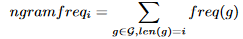

# Core IR project

Paper can be found at:
https://www.microsoft.com/en-us/research/wp-content/uploads/2015/10/spir0468-mitra.pdf

## Data

The `AOL_search_data_leak_2006.zip` file is required. A python distribution with `pandas` and
`dask` installed ([Anaconda](https://anaconda.org/) has it installed an probably also all the other
things we ever need).

## Notebook

Create a Jupyter config

```bash
$ jupyter notebook --generate-config
```

Add the following to `~/.jupyter/jupyter_notebook_config.py`.

```python
import os
from subprocess import check_call

def post_save(model, os_path, contents_manager):
    """post-save hook for converting notebooks to .py scripts"""
    if model['type'] != 'notebook':
        return # only do this for notebooks
    d, fname = os.path.split(os_path)
    check_call(['jupyter', 'nbconvert', '--to', 'script', fname], cwd=d)

c.FileContentsManager.post_save_hook = post_save
```

This way we can properly version control our python ramblings and run scripts without having to
open up Jupyter.

## Files

After running the scripts several files are created.

|Filename|Description|Generated by
|--|--|--
|`total_data.csv`|Complete data set|[1]/[1nb]
|`background.csv`|Non-normalized background set|[2]/[2nb]
|`test.csv`|Non-normalized test set|[2]/[2nb]
|`training.csv`|Non-normalized training set|[2]/[2nb]
|`validation.csv`|Non-normalized validationset|[2]/[2nb]
|`background_normalized.csv`|Normalized background set|[2]/[2nb]
|`test_normalized.csv`|Normalized test set|[2]/[2nb]
|`training_normalized.csv`|Normalized training set|[2]/[2nb]
|`validation_normalized.csv`|Normalized validation set|[2]/[2nb]
|`popular_suffix.csv`|Top suffixes from background with count|[3]/[3nb]
|`total_data_ngrams.csv`|All suffixes from background set|[3]/[3nb]
|`popular_query.csv`|Top 724,340 queries from background|[4]/[3nb]
|`generated_candidate.csv`|Candidates generated from background|[5]/[5nb]


## Steps

### Data preparation

Run `1-Core-IR-Prep.py` ([1]) and `2-Core-IR-Split.py` ([2]) to
prep data and split according to the definition in the paper

 - Prep data
 - Split training and validation data

#### From the paper

> The query impressions on both the testbeds are divided into four temporally separate partitions
> (background, training, validation and test). On theAOL testbed we use all the data from 1 March,
> 2006 to 30 April, 2006 as the background data. We sample queries from the next two weeks for
> training, and from each of the following two weeks for validation and test, respectively. On the
> Bing testbed we sample data from the logs from April, 2015 and use the first week of data for
> background, the second week for training, the third for validation and the fourth for testing. We
> normalize all the queries ineach of these datasets by removing any punctuation characters and
> converting them to lower case.
>
> For candidate generation, both the list of popular queries andsuffixes are mined from the
> background portion of the two testbeds.We use 724,340 and 1,040,674 distinct queries on the AOL
> testbed and the Bing testbed, respectively, as the set of full-query candidates. We evaluate our
> approach using 10K and 100K most frequent suffixes. We limit the number of full-query candidates
> per prefix to ten and compute the final reciprocal rank by considering only the top eight ranked
> suggestions per model. Finally, the CLSM models are trained using 44,558,631 and 212,854,198
> prefix-suffix pairs onthe AOL and the Bing testbeds, respectively.

### Candidate generation

Run [`3-Core-IR-ngrams.py`](./3-Core-IR-ngrams.py) to extract all ngram suffixes from the
background data. And run [`4-Core-IR-PopularQuery.py`](./4-Core-IR-PopularQuery.py) to extract the
top 724,340 distinct queries from the background data.

**TODO**: Generate candidate queries based on the found ngram suffixes

Format of the generated candidate:

|prefix|suffix|candidate|
|--|--|--
|The prefix of the query|The suffix form the most popular suffixes|The candidate query in full|

#### From the paper

> for a given prefix we extract the end-term as shown in Figure 1. We match all the suffixes that
> start with the end-term from our precomputed set. These selected suffixes are appended to the
> prefix to generate synthetic suggestion candidates. For example, the prefix "cheap flights fro"
> is matched with the suffix "from seattle" to generate the candidate "cheap flights from seattle".
> Note that many of these synthetic suggestion candidates are likely to not have been observed by
> the search engine before. We merge these synthetic suggestions with the set of candidates
> selected from the list of historically popular queries. This combined set of candidates is used
> for ranking as we will describe in Sec 4.

And for popular queries:

> For candidate generation, both the list of popular queries and suffixes are mined from the
> background portion of the two testbeds. We use 724,340 and 1,040,674 distinct queries on the AOL
> testbed and the Bing testbed, respectively, as the set of full-query candidates

### Formalize and implement ranking features

**TODO**: Implement generating this feature.

#### From the paper

> _Other features._ Other features used in our model includes the frequency of the candidate query
> in the historical logs, length based features (length of the prefix, the suffix and the full
> suggestion in both characters and words) and a boolean feature that indicates whether the prefix
> ends with a space character.

This gives us:

- frequency of the candidate query in the historical logs
- length of the prefix in characters
- length of the prefix in words
- length of the suffix in characters
- length of the suffix in words
- length of the full suggestion
- length of the full words
- whether a prefix ends with a space (boolean)

Maybe come up with some more features as this list might not be exhaustive.

### Implement _n_-gram based features

Use [`6-Core-IR-FeatureGeneration.py`](./6-Core-IR-FeatureGeneration.py) to generate these features.

#### From the paper

> _N-gram based features._ From the set of all n-grams G in a candidate suggestion we compute the
> n-gram frequency features n gram _freq<sub>i</sub>_ (for _i_ = 1 to 6).
>
> 
>
> Where _len(g)_ and _freq(g)_ are the number of words in the _n_-gram _g_ and its observed
> frequency in the historical query logs, respectively. Intuitively, these _n_-gram features model
> the likelihood that the candidate suggestion is generated by the same language model as the
> queries in the search logs.

### Implement selection of suffix based candidates

The meat of our reproduction. Have a way to select the _n_ most frequent suffix based candidates
from the data. For our reproduction we need to be able to easily pull the following number of
suffix based candidates:

- 1K most frequent suffixes
- 5K most frequent suffixes
- 10K most frequent suffixes (validate)
- 20K most frequent suffixes
- 50K most frequent suffixes
- 75K most frequent suffixes
- 100K most frequent suffixes (validate)

### Feature file format

|Col|Desc|
|--|--
|prefix|
|suggestion candidate|
|ngramfreq_1|
|ngramfreq_2|
|ngramfreq_3|
|ngramfreq_4|
|ngramfreq_5|
|ngramfreq_6|
|query freq|Frequency of the query in `background`
|prefix_len_c|Length of the prefix in characters
|prefix_len_w|Length of the prefix in words
|suffix_len_c|Length of the suffix in characters
|suffix_len_w|Length of the suffix in words
|len_c|Length of the candidate in characters
|len_w|Length of the candidate in words
|end_space|Wether the prefix ends with a space

## Validation / Testing

Given a model which for some prefix returns a set of 8 suggestions. 

For each element in the validation set generate all prefixes and for each prefix the MMR is
calculated by `1 / rank` or `0` if the actual query is not in the rank.

## Flows

|Source|Thru|Result|
|--|--|--
|`.zip`|[Prep]|`total_data.csv`
|`total_data.csv`|[Split]|`{background,test,training,validation}.csv`
|`{background,test,training,validation}.csv`|[Split]|`{background,test,training,validation}_normalized.csv`
|`background_normalized.csv`|[ngrams]|`popular_suffix.csv`
|`background_normalized.csv`|[PopularQueries]|`popular_query.csv`
|`test_normalized.csv`|[sampling]|`test_sampled.csv`
|`validate_normalized.csv`|[sampling]|`validate_sampled.csv`
|`training_normalized.csv`|[CandidateGeneration]|`training_sampled.csv`
|`{test,training,validation}_sampled.csv`|[FeatureGeneration]|`{test,training,validation}_features.csv`

[1]: ./1-Core-IR-Prep.py
[1nb]: ./1-Core-IR-Prep.ipynb
[Prep]: ./1-Core-IR-Prep.ipynb
[2]: ./2-Core-IR-Split.py
[2nb]: ./2-Core-IR-Split.ipynb
[Split]: ./2-Core-IR-Split.ipynb
[3]: ./3-Core-IR-ngrams.py
[3nb]: ./3-Core-IR-ngrams.ipynb
[ngrams]: ./3-Core-IR-ngrams.ipynb
[4]: ./4-Core-IR-PopularQueries.py
[4nb]: ./4-Core-IR-PopularQueries.ipynb
[PopularQueries]: ./4-Core-IR-PopularQueries.ipynb
[5]: ./5-Core-IR-CandidateGeneration.py
[5nb]: ./5-Core-IR-CandidateGeneration.ipynb
[CandidateGeneration]: ./5-Core-IR-CandidateGeneration.ipynb
[7]: ./7-Core-IR-FeatureGeneration.py
[7nb]: ./7-Core-IR-FeatureGeneration.ipynb
[FeatureGeneration]: ./7-Core-IR-FeatureGeneration.ipynb